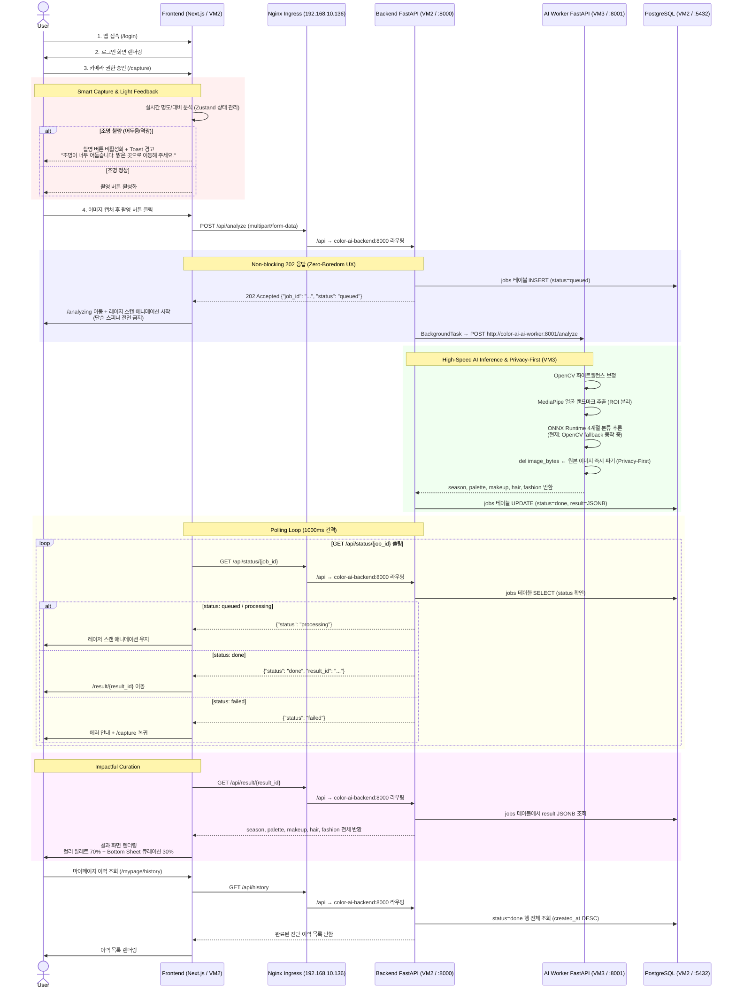

# User Flow: Personal Color AI Analysis Application

본 문서는 사용자가 앱에 접속하여 퍼스널 컬러 진단 결과를 얻고 이력을 관리하기까지의  
전체 UX 흐름과 백엔드 시스템(K8s/AI/DB)의 상호작용을 정의합니다.  
Phase 5 완료 기준으로 실제 구현된 엔드포인트와 인프라를 반영합니다.

---

## User Flow Diagram



---

## 단계별 상세 플로우

### Step 1 — 진입 및 인증 (Onboarding)

| 순서 | 행위 | 기술 |
|------|------|------|
| 1 | 모바일 웹 접속 | Next.js App Router SSR |
| 2 | `/login` 페이지 렌더링 | `app/src/app/login/page.tsx` |
| 3 | 카메라 권한 요청 | `getUserMedia` API |

---

### Step 2 — 스마트 캡처 및 조명 피드백

| 순서 | 행위 | 기술 |
|------|------|------|
| 1 | 화면 전체 뷰파인더 + 얼굴 오버레이 가이드라인 표시 | `app/src/app/capture/page.tsx` |
| 2 | 실시간 명도/대비 분석 | Zustand(`capturedImage` 상태) |
| 3-A | **조명 불량:** 촬영 버튼 비활성화 + Toast 경고 | Disabled Button + Toast |
| 3-B | **조명 정상:** 촬영 버튼 활성화 | Primary Button |
| 4 | 이미지 캡처 → canvas 저장 | HTML Canvas API |

**조명 피드백 UX Writing:**
```
어두움/역광: "조명이 너무 어둡습니다. 밝은 곳으로 이동해 주세요."
역광 감지:   "역광이 감지되었습니다. 빛을 정면으로 받아주세요."
```

---

### Step 3 — 분석 요청 및 인터랙티브 로딩

| 순서 | 행위 | 기술 |
|------|------|------|
| 1 | POST /api/analyze 호출 | `multipart/form-data` |
| 2 | MetalLB(192.168.10.136) → Nginx Ingress → FastAPI(VM2:8000) 라우팅 | K8s Ingress |
| 3 | job_id 발급 + PostgreSQL status=queued 저장 | asyncpg |
| 4 | 202 즉시 반환 + BackgroundTask로 AI Worker 위임 | FastAPI BackgroundTasks |
| 5 | `/analyzing` 이동 + 레이저 스캔 애니메이션 시작 | `app/src/app/analyzing/page.tsx` |

> ⚠️ **Zero-Boredom 원칙:** 단순 스피너(Spinner) 사용 **전면 금지**  
> 캡처된 이미지를 배경으로 레이저 스캔 애니메이션 즉시 재생

---

### Step 4 — AI 추론 및 Privacy-First 처리 (VM3)

| 순서 | 행위 | 기술 |
|------|------|------|
| 1 | 이미지 수신 (AI Worker) | `color-ai-ai-worker:8001` (ClusterIP) |
| 2 | 화이트밸런스 보정 | OpenCV (`opencv-python-headless==4.10.0.84`) |
| 3 | 얼굴 랜드마크 추출 + ROI 분리 | MediaPipe (`mediapipe==0.10.9`) |
| 4 | 4계절 분류 추론 | ONNX Runtime (현재: OpenCV fallback) |
| 5 | **원본 이미지 즉시 파기** | `del image_bytes` |
| 6 | 결과 반환 (season, palette, makeup, hair, fashion) | JSON |
| 7 | PostgreSQL jobs 테이블 UPDATE (status=done, result=JSONB) | asyncpg |

**현재 AI Worker 상태:**

| 모듈 | 상태 |
|------|------|
| OpenCV 전처리 | ✅ 동작 중 |
| MediaPipe 랜드마크 | ✅ 동작 중 |
| ONNX 추론 | ⏳ Phase 6 예정 (현재 OpenCV fallback) |
| Privacy-First 파기 | ✅ `del image_bytes` 적용 |

---

### Step 5 — 폴링 루프 (/analyzing 페이지)

```
GET /api/status/{job_id} → 1000ms 간격 반복 (NEXT_PUBLIC_POLL_INTERVAL_MS)

  status: queued/processing  → 레이저 스캔 애니메이션 유지
  status: done               → result_id 저장 (Zustand) → /result/{result_id} 이동
  status: failed             → 에러 안내 → /capture 복귀
```

---

### Step 6 — 결과 렌더링 (Impactful Curation)

| 영역 | 비율 | 내용 |
|------|------|------|
| 상단 컬러 팔레트 | **70% 이상** | season, label, description + Hex 5개 스와치 |
| 하단 Bottom Sheet | 30% | makeup(lip, shadow), hair, fashion 큐레이션 |

**실제 분석 결과 샘플 (Autumn):**
```
season      : autumn
label       : 가을 웜톤
description : 깊고 따뜻한 캐멜, 테라코타, 올리브 계열
palette     : #D2691E, #CD853F, #8B4513, #556B2F, #DAA520
lip         : 따뜻한 브라운/핑크 계열
shadow      : 브라운 계열
hair        : 골든 브라운 (골든 8 : 코퍼 2)
fashion     : 내추럴 & 웜, 어스톤 & 카키
```

---

### Step 7 — 진단 이력 조회 (/mypage/history)

```
GET /api/history
  → PostgreSQL jobs 테이블에서 status=done 행만 조회
  → created_at 내림차순 정렬
  → job_id, result_id, season, created_at 반환
```

---

## 예외 처리 흐름

| 상황 | 발생 위치 | UI 처리 |
|------|----------|---------|
| 카메라 권한 거부 | /capture | 권한 안내 팝업 + 설정 이동 유도 |
| 조명 불량 | /capture | 촬영 버튼 비활성화 + Toast 경고 |
| 분석 실패 (status: failed) | /analyzing | "분석에 실패했습니다. 밝은 곳에서 정면을 보고 다시 시도해주세요." + /capture 복귀 |
| 네트워크 오류 | 전체 | 재시도 버튼 제공 |
| AI Worker 응답 없음 | /analyzing | failed 처리 후 /capture 복귀 |

---

## 인프라 트래픽 흐름 요약

```
사용자 요청
  │
  ▼
MetalLB (192.168.10.136)          ← 외부 IP 할당
  │
  ▼
Nginx Ingress Controller (VM2)    ← L7 라우팅
  ├── /          → Next.js (color-ai-frontend:3000, VM2)
  └── /api       → FastAPI (color-ai-backend:8000, VM2)
                       │
                       ├── BackgroundTask
                       │     └── AI Worker (color-ai-ai-worker:8001, VM3) ← ClusterIP
                       │
                       └── PostgreSQL (postgresql-svc:5432, VM2) ← ClusterIP
```

---
